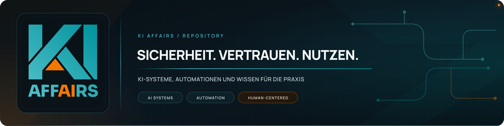

<!-- ki-affairs-banner:start -->

<!-- ki-affairs-banner:end -->

# podcast-blog-images

Öffentlicher Bild-Host für die KI-AffAIrs-Podcast-Blogposts (kiaffairs.blogspot.com). Enthält ausschließlich bereits veröffentlichte Blog-Illustrationen als Raw-URLs, kein Quellcode, keine internen Daten.

Struktur: `bilder/<folge-nummer>/<bildname>.png`
